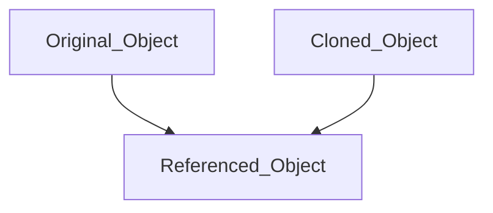
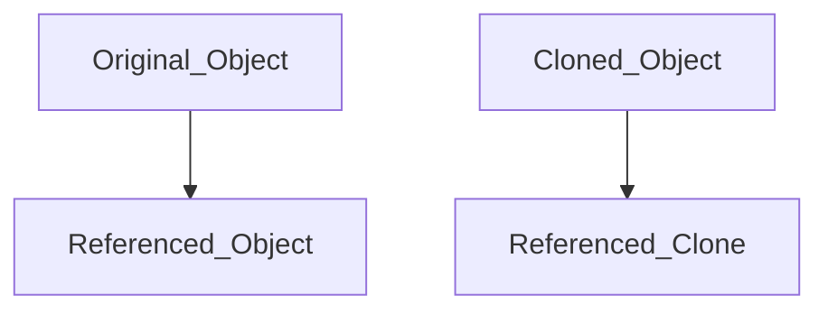

# *Arrays*

## Arrays are just regular objects

1. the items in the array are nothing more than properties of that objects

2. An array has, alongside its elements, a special property named `length` and a generous **collection of methods for manipulating** the elements. They represent the real power of arrays. You can search, sort, delete, insert, etc.

## Declaring an Array

```javascript
let arr = [1, 2, 3, 4, 5]
```

    or

```javascript
let arr = new Array(1, 2, 3, 4, 5)
```

An array can store elements of any type. For ex:

```javascript
let arr = [1, 2, 'apple', true, { total: 1 }, function(){console.log('hey')}, undefined, null]
```

> always try to use array literals instead of the Array constructor

## Accesing array elements

JavaScript arrays are zero-indexed: the first element of an array is at index `0`, and the last element is at the index equal to the value of the array's `length` property minus 1. Using an invalid index number returns `undefined`.

```javascript
let arr = ['apple', 'mango', 'cherty'];
console.log(arr[0]); // apple
console.log(arr[1]); // mango
console.log(arr[arr.length - 1]); // cherry
console.log(arr[100]); // undefined
```

> trying to access an element of an array as follows throws a syntax error because the property name is not valid: 
> 
> ```javascript
> console.log(arr.0); //syntax error
> ```

## Detecting an Array

The `Array.isArray()` method determines whether the passed value is an [`Array`](https://developer.mozilla.org/en-US/docs/Web/JavaScript/Reference/Global_Objects/Array "The JavaScript Array object is a global object that is used in the construction of arrays; which are high-level, list-like objects.").

Syntax:      `Array.isArray(value)`

`Array.isArray` method return a `true` if the value is an `Array` ; othewise `false`

```javascript
Array.isArray([1, 2, 3]);  // true
Array.isArray({foo: 123}); // false
Array.isArray('foobar');   // false
Array.isArray(undefined);  // false
```

## The `length` Property

- An `Array` has a special property `length` which simply returns the length of an `Array`

- Whenever you add a new element, the value of length will be updated

>  The `length` property can also be set externally. We can truncate an array by setting `length`

```javascript
let arr = [1, 2, 3, 4];
console.log(arr.length); // 4
arr[20] = 2; 
console.log(arr.length); // 21 - even though there are no elements between index 5 and 19
```

> Remember
> 
> - its a bad practice to add elements to array at random indexs
> 
> - Dont change the property of an array like a regular object.
> 
> - Always use the array methods to modify an array

## Array Methods

- #### `indexOf()`: returns the first index at which a given element can be found in the array, or -1 if it is not present.
  
  ```javascript
  let days = let days = ['Monday', 'Tuesday', 'Wednesday', 'Thursday'];
  console.log(days.indexOf('Monday')); // 0
  console.log(days.indexOf('Tuesday')); // 1
  console.log(days.indexOf('Friday')); // -1
  ```

- #### `push()` :   `push`  appends one or more element to the end of an array.
  
  ```javascript
  let days = ['Monday'];
  days.push('Tuesday');
  days.push('Wednesday', 'Thursday', 'Friday');
  console.log(days); // ["Monday", "Tuesday", "Wednesday", "Thursday", "Friday"]
  ```

- #### `pop()` :  `pop`  takes an element from the end of an array
  
  ```javascript
  let days = ["Monday", "Tuesday", "Wednesday", "Thursday", "Friday"];
  days.pop();
  console.log(days); // ["Monday", "Tuesday", "Wednesday", "Thursday"]
  ```

- #### `shift()` : Extracts the first element of the array and returns it
  
  ```javascript
  let days = ["Monday", "Tuesday", "Wednesday", "Thursday", "Friday"];
  let removedDay = days.shift(); // removes Monday and assigns it to removedDay;
  console.log(days); // ["Tuesday", "Wednesday", "Thursday", "Friday"]
  ```

- #### `unshift()` : Add the element to the beginning of the array
  
  ```javascript
  let days = ["Monday", "Tuesday", "Wednesday", "Thursday", "Friday"];
  days.unshift("Sunday");
  console.log(days); // ["Sunday", "Monday", "Tuesday", "Wednesday", "Thursday", "Friday"];
  ```
  
  > - Methods `push/pop` run fast, while `shift/unshift` are slow.
  > 
  > - Methods `push` and `unshift` can add multiple elements at once:
  >   
  >   ```javascript
  >   var days = ["Tuesday"];
  >   days.push("Wednesday", "Thursday");
  >   days.unshift("Sunday", "Monday");
  >   console.log(days); // ["Sunday", "Monday", "Tuesday", "Wednesday", "Thursday"]
  >   ```

- #### `join()` : returns a new string by concatenating all of the elements in an array separated by commas or a specified separator string
  
  ```javascript
  let days = ["Monday", "Tuesday", "Wednesday"];
  console.log(days.join()); // 'Monday,Tuesday,Wednesday'
  console.log(days.join('-')); // 'Monday-Tuesday-Wednesday'
  console.log(days.join(' ')); // 'Monday Tuesday Wednesday'
  console.log(days.join(123)); // 'Monday123Tuesday123Wednesday'
  ```

- #### `concat()`: merge two arrays  and return it as a new array
  
  ```javascript
  let days1 = ["Monday", "Tuesday", "Wednesday"];
  let days2 = ["Thursday", "Friday", "Saturday"];
  let days3 = days2.concat(days2);
  console.log(days3); // ["Monday", "Tuesday", "Wednesday", "Thursday", "Friday", "Saturday"]
  ```

- #### `slice()` :

- #### `splice()` : method changes the contents of an array by removing or replacing existing elements and/or adding new elements
  
  #### 
  
  > The built-in array method splice() is rather versatile and inserts new, deletes existing, and replaces existing elements with new elements in the array. The beauty of splice() is that it does not leave the array sparse because it will shift the elements to higher or lower positions as necessary; there will be no gap left.
  
  ```javascript
  let days = ["Monday", "Tuesday", "Wednesday", "Thursday", "Friday"];
  console.log(days.splice(4, 1)); // ["Friday"]
  console.log(days); // ["Monday", "Tuesday", "Wednesday", "Thursday"]
  
  // Using the third argument and higher, the splice method can also be used to replace one or more elements with others
  
  days.splice(0, 1, "Saturday", "Sunday");
  console.log(days); // ["Saturday", "Sunday", "Tuesday", "Wednesday", "Thrusday"]
  
  // splice method can be used to add elements to end of array similar to push method
  days.splice(days.length, 0, "Friday");
  console.log(days); // ["Saturday", "Sunday", "Tuesday", "Wednesday", "Thrusday" , "Friday"]
  
  // splice method can be used to add elements to start of array similar to unshift method
  days.splice(0, 0, "__Friday");
  console.log(days); // ["__Friday", "Saturday", "Sunday", "Tuesday", "Wednesday", "Thrusday" , "Friday"]
  
  // splice method can also be used to clear an array
  days.splice(0, days.length)
  ```

- #### `sort()` :

- #### `reverse()` :

- #### `fill()` :

- #### `toString()` :

### Iterator methods:

- #### `forEach()`

- #### `keys()`

- #### `map()`

- #### `reduce()`

- #### `filter()`

- #### `find()`

## Creating a copy of an array

1. Shallow copy




2. Deep Copy



### ways to create a copy of array

- slice method -> shallow copy

- json.stringify - json.parse -> deep copy (not a correct method for comparision)

- [...array] -> spread operator -> shallow copy

- Array.from --> shallow copy

- Object.assign({},[]) -> shallow copy

- libraries like lodash, underscore

- custome method


### Practice Questions

1. Write a function to get first n elements of an array.
   
   ```javascript
   function getElements(array, n) {
       // code comes here
   };
   
   const firstN = getElements([1, 2, 3, 5, 10, 1212, 0, 'red'], 3);
   console.log(firstN);
   // expected output [1,2,3]
   ```

2. Write a function to join all elements of array into a string
   
   ```javascript
   function joinArray(array) {
       // code comes here
   }
   
   console.log(joinArray([1, 2, 3, 4, 'javascript']));
   // expected output 1234javascript
   ```

3. Write a function to find the most frequent element of an array
   
   ```javascript
   function getMostFrequent(array) {
       // code comes here
   }
   
   getMostFrequent([1,3, 'a','a,'c', true, 1, 3, 4, 10, 1]);
   // expected output 
   // 'most frequent "1" --> 3 times'
   ```

4. Write a JavaScript program which accept a string as input and swap the case of each character.
   
   ```javascript
   function swapCase(sentence) {
       // code comes here
   }
   
   console.log(swapCase('We are learning JavaScript'));
   // expected output
   // 'wE ARE LEARNING jAVAsCRIPT'
   ```

5. Write a function to print largest number in an array
   
   ```javascript
   function getLargest(array) {
       // code comes here
   }
   
   console.log(getLargest([0, 10, -4, 5, 11, 16, 3]));
   // expected output
   // 16
   ```

6. Write a function to print sum of all the numbers in an array
   
   ```javascript
   function getSum(array) {
    // code comes here
   }
   console.log(getSum([1, 2, 3, 4, 5, 6, 7, 8, 9]));
   // expected output
   // 45
   ```

7. Write a function to return an array containing square of all the number of an array 
   
   ```javascript
   function squaredArray(array) {
      // code comes here
   }
   
   console.log(squaredArray([1, 2, 3, 4, 5, 6, 7, 8, 9]));
   // expected output
   // [1, 4, 9, 16, 25, 36, 49, 64, 81]
   ```


8. Write a function to return the sum of squares of all the numbers of array whose squares are divisible by 4
   
   ```javascript
   function getResult(array) {
       // code comes here
   }
   
   console.log(getResult([1, 2, 3, 4, 5, 6, 7, 8, 9]));
   // expected output
   // 120
   ```


